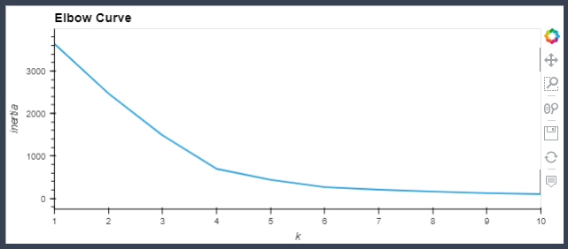
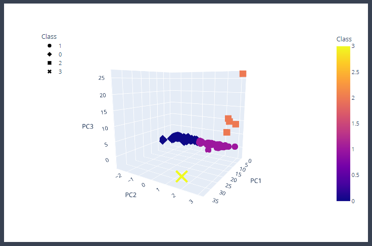
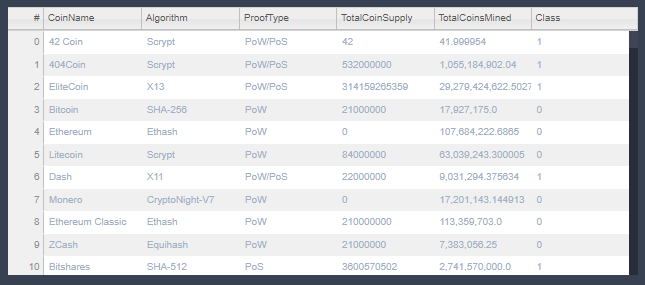
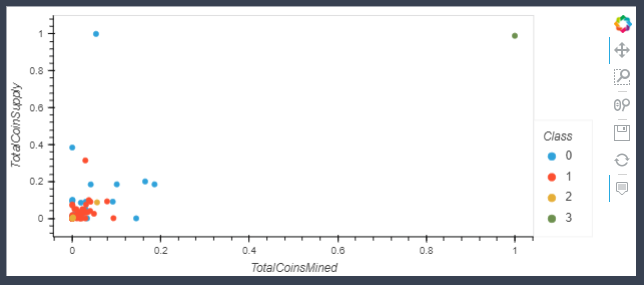

# **Cryptocurrencies**

## **Resources**
*   **Data Source:** 
    *   [crypto_data.csv](resources/data/crypto_data.csv)
        *   Data retrieved from [CryptoCompare](https://min-api.cryptocompare.com/data/all/coinlist)
*   **Software:**
    *   Anaconda 4.11.0
    *   Jupyter Notebook 6.4.5
    *   Python 3.9.7
        *   Libraries:
            *   Pandas
            *   hvPlot
            *   Plotly
            *   SciKit-Learn
    *   Visual Studio Code 1.63.2

## **Overview**
This project's goals was to take the `crypto_data.csv` dataset and process it to work with the unsupervised machine learning clustering models. The purpose of which is to identify which cryptos would be good options for further investigation for potential investing options. 

There were four things that needed to be completed:
1.  Preprocess the data for Principal Component Analysis (PCA) 
2.  Reduce data dimensions using PCA
3.  Cluster using K-Means
4.  Visualize results

## **Results**
These images are captures of the outputs from the `crypto_clustering.ipynb` file used for this processing, if you would like to see the specific code that made these visuals possible please [follow this link](crypto_clustering.ipynb) or navigate to the `crypto_clustering.ipynb` file from the repo homepage.

### **Elbow Curve**

Generating an elbow curve plot shows the ideal number of clusters to use with the data. In this case, that number is 4 since after that there are diminishing returns and the possibility of overfitting.

### **3D Scatter**

This 3D scatter plot shows the 4 clusters separated out based on the Principal Components.
* Note: The capture of this 3D scatter plot may not represent the data well since it is not intractable, I positioned the graph to best show the clusters.

### **Tradable Table**

The interactive table created with the `hvplot.table()` function is meant to help the user navigate cryptos that would possibly be good for trading. The "Class" column refers to which cluster that specific coin falls under.

### **2D Scatter**

The last visual generated is a 2D scatter plot that displays the cryptos relative to their total coin supply and total coins mined. Once again "Class" refers to which cluster they belong to.

## **Summary**
What has been put together here is a breakdown and classification of all 1252 listed cryptos into 532 tradable cryptos. We have ruled out all non ideal crypto options from the original dataset and grouped the remaining cryptos into 4 clusters. Further analysis is required to determine which cluster might be the best option for investors based on several factors including: performance(past and projected), public interest, underlying technology(algorithm), and efficiency if that data is available.