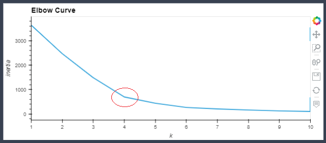

# **Cryptocurrencies**

# **Resources**
*   **Data Source:** 
    *   [crypto_data.csv](resources/data/crypto_data.csv)
*   **Software:**
    *   Anaconda 4.11.0
    *   Jupyter Notebook 6.4.5
    *   Python 3.9.7
        *   Libraries:
            *   Pandas
            *   hvPlot
            *   Plotly
            *   SciKit-Learn
    *   Visual Studio Code 1.63.2

# **Overview**
This project's goals was to take the data from the `crypto_data.csv` and process it to work with the unsupervised machine learning clustering models. 

There were four things that needed to be completed:
1.  Preprocess the data for Principal Component Analysis (PCA) 
2.  Reduce data dimensions using PCA
3.  Cluster using K-Means
4.  Visualize results

# **Results**
These images are captures of the outputs from the [crypto_clustering.ipynb](crypto_clustering.ipynb) file.

# **Summary**